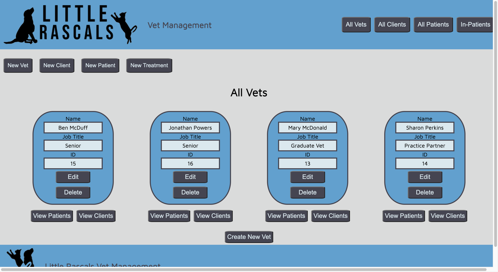

# Little Rascals
Little rascals is a vet management app designed to aid vets with the management of their clients, patients and treatments.

## MVP
- The practice wants to be able to register / track animals. Important information for the vets to know is -
  - Name
  - Date Of Birth (use a VARCHAR initially)
  - Type of animal
  - Contact details for the owner
  - Treatment notes
- Be able to assign animals to vets
- CRUD actions for vets / animals - remember the user - what would they want to see on each View? What Views should there be?
## Possible Extensions
- Mark owners as being registered/unregistered with the Vet. unregistered owners won't be able to add any more animals.
- If an owner has multiple animals we don't want to keep updating contact details separately for each pet. Extend your application to reflect that an owner can have many pets and to more sensibly keep track of owners' details (avoiding repetition / inconsistencies)
- Handle check-in / check-out dates
- Let the practice see all animals currently in the practice (today's date is between the check-in and check-out?)
- Sometimes an owner does not know the DOB. Allow them to enter an age instead. Try and make sure this always up to date - ie if they visit again a year from now a 3 yr old dog is now 4.
- Add extra functionality of your choosing - assigning treatments, a more comprehensive way of maintaining treatment notes over time. Appointments. Pricing / billing.

## Timescale
1 week build time

## Limitations/Restrictions
The project must be built using only:

- HTML / CSS
- Python
- Flask
- PostgreSQL and the psycopg
It must NOT use:

- Any Object Relational Mapper (e.g. ActiveRecord)
- JavaScript. At all. Don't even think about it.
- Any pre-built CSS libraries, such as Bootstrap.
- Authentication. Assume that the user already has secure access to the app.

## Setup/Installation
Run the app from the root folder using:

    $ python3 app.py
